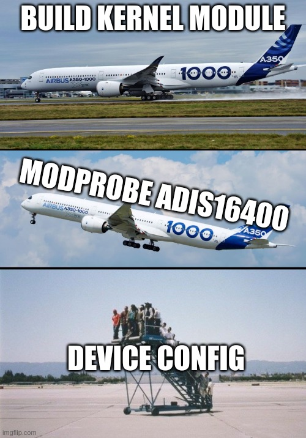

# mav_imu

Userspace driver for adis16448 written in C++17.

## Setup

1. Install dependencies

```shell
$ sudo apt-get install ros-noetic-imu-tools libgoogle-glog-dev
$ git clone git@github.com:ethz-asl/lpp.git
```

2. Go to the catkin workspace and clone this repo in the `src` folder and build it with
```shell
$ git clone git@github.com:ethz-asl/mav_imu.git
$ catkin build mav_imu
```
3. Source environment

```shell
$ source /opt/ros/noetic/setup.bash
$ source ~/catkin_ws/devel/setup.bash
```

4. Launch node
```shell
$ roslaunch mav_imu imu_default.launch
```

- Optionally run with `rviz`

```shell
$ roslaunch mav_imu imu_rviz.launch
```

- Optionally run with `imu_madgwick_filter`

```shell
$ rosrun imu_madgwick_filter imu_filter_node
```

***

There is also a kernel level driver but:


